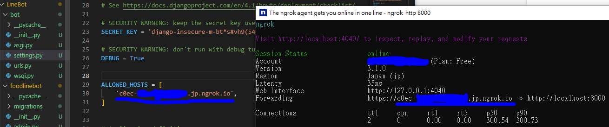

# MY LineBots
* Django
* BeautifulSoup + requests
* PostgreSQL

## Apps
* foodlinebot: Find recommended restaurants
* triplinebot: Find recommended spots

## Deployment
1. Regist a [render account](https://dashboard.render.com/#)

## Local Test
1. install [ngrok](https://ngrok.com/download)
2. execute
    * `ngrok config add-authtoken <TOKEN>`
    * `ngrok http 8000`
3. go to `bot.settings` -> add https address which generated by ngrok to `ALLOWED_HOSTS`

4. `python manage.py runserver`
5. go to [Line Developers](https://developers.line.biz/en/)
6. Choose APP -> Messaging API -> Webhook URL -> add https address
